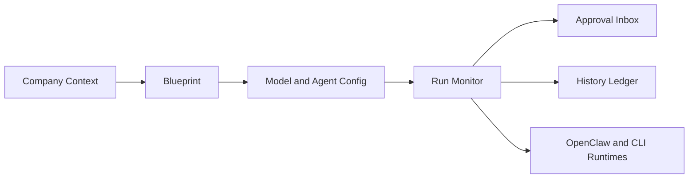

# Hiveward

<p align="center">
  <picture>
    <source media="(prefers-color-scheme: dark)" srcset="apps/web/public/brand/hiveward-wordmark-on-dark.png">
    
  </picture>
</p>

<h2 align="center">Put 101 agents to work together for you.</h2>

<p align="center">
  Organize OpenClaw, Claude Code, Codex, Google CLI, Cursor CLI, OpenCode, and Hermes into one schedulable, reviewable, auditable Agent Company.
</p>

<p align="center">
  
  <a href="https://www.npmjs.com/package/@hiveward/cli"></a>
  
  
  
  
</p>

<p align="center">
  <a href="#what-is-hiveward">What is Hiveward?</a> ·
  <a href="#what-is-a-blueprint">What is a blueprint?</a> ·
  <a href="#how-it-works">How it works</a> ·
  <a href="#product-surfaces">Product surfaces</a> ·
  <a href="#notes">Notes</a> ·
  <a href="#quick-start">Quick start</a>
</p>

<p align="center">
  <strong>English</strong> | <a href="README.md">简体中文</a>
</p>


<p align="center">
  <sub>A Manager blueprint dispatches Slots and agents on the canvas, with curved links showing the active coordination path while Hiveward tracks outputs and evidence. More product screenshots live on the <a href="docs/screenshots.md">screenshots page</a>.</sub>
</p>

## What is Hiveward?

Hiveward's slogan is: Put 101 agents to work together for you.

Hiveward is an open-source workspace for Agent Companies. It does not try to become another model, and it does not hide all work inside a chat box. It gives agent teams a visible, governable, reviewable operating structure.

Think of it as an operations desk for the next generation of AI organizations: company as scope, blueprint as organization chart, models as resource pool, inbox as governance layer, and history as execution ledger.

Hiveward manages and displays company goals, blueprint structure, node configuration, model selection, run state, human approvals, and history. Real execution remains owned by OpenClaw, Claude Code, Codex, Google CLI, Cursor CLI, OpenCode, and Hermes, keeping Hiveward as a clean product layer instead of leaking runtime mechanics into the UI.

## What is a blueprint?

A blueprint is not a static diagram. It is a runnable agent work definition that describes who does what, in which order, when work must be summarized or approved, and how results are delivered.

A blueprint has three core parts:

- Nodes: agents, managers, parallel lanes, summaries, approvals, and delivery steps.
- Edges: success paths, failure paths, sequencing, and rollback routes between nodes.
- Run records: node status, inputs, outputs, OpenClaw references, cost, and timing evidence for each execution.

Manager nodes act as dispatchers inside a blueprint. They read upstream input and previous results, choose the next Slot, assign work to agents, request rework, or finish the workflow. This turns agents from one-off chat sessions into organized, managed, reviewable work units.

## Why Hiveward?

Modern agent tools can write code, research, and execute tasks, but the product experience is still often a chat window plus repeated prompt copying. Once work becomes complex, the limits appear quickly:

- There is no clear operating structure for who starts, reviews, and delivers.
- Execution is hidden inside conversations, making failures and intermediate outputs hard to inspect.
- Model choice and agent identity blur together.
- Human decisions have no stable approval surface.
- Finished work does not become reusable team capability.

Hiveward starts from a different assumption: agents should not only be smarter chat partners. They should become organized, managed, and auditable work units.

## How it works

1. Choose a company: every company owns its own goals, blueprints, run records, and approval context.
2. Design a blueprint: place agents, managers, parallel lanes, summaries, approvals, and delivery nodes on one canvas.
3. Configure models and harnesses: inspect models, defaults, agent identity, status checks, and capability information from OpenClaw and supported CLI harnesses.
4. Start a run: Hiveward orchestrates blueprint nodes and shows each step's state, output, and evidence.
5. Approve and review: human decisions land in the inbox, while completed work becomes execution history.



## Product surfaces

The main README keeps one trusted run-state screenshot so new users see the core product loop first. Additional screenshots are maintained on the [screenshots page](docs/screenshots.md), including:

- Blueprint Studio: express how an agent team works on a runnable canvas.
- Model Configuration: inspect models, defaults, usage, OpenClaw catalog capabilities, and CLI harness status.
- Run Monitor: watch node-level status, output previews, failure state, and execution evidence.
- Inbox: handle workflow steps that require human judgment.
- History: review successful runs, failed runs, output summaries, and timing.

## Core capabilities

- Company context: organize goals, blueprints, runs, and approvals by company.
- Blueprint orchestration: describe agent team structure with visual nodes.
- Manager dispatch: let Manager nodes choose Slots, assign agents, request rework, or finish a workflow.
- Agent team management: separate Hiveward display identity from the real OpenClaw, Claude Code, Codex, and CLI harness identities.
- Model resource pool: inspect models, defaults, usage, and provider state.
- Human governance: handle judgment points through the inbox.
- Run ledger: turn every execution into reviewable history.
- Runtime boundary: Hiveward owns the product layer; OpenClaw and the configured CLI harnesses own real execution.

## Notes

For the best first-run experience, open the configuration page for each harness you plan to use and install / configure the HiveWard Skills into that harness. This places the CEO, Leader, and skill-decomposer operating manuals in the native harness Skill directory so later chats and blueprint runs can call the right operating instructions more reliably.

## Current status

Current version: `v0.5.8`. Core product surfaces are ready for local demos and early use. Google CLI, Cursor CLI, OpenCode, and Hermes are available as CLI harnesses, while APIs and interaction details may still evolve.

## Quick start

### npm CLI install

Hiveward can be installed as a product command:

```bash
npm install -g @hiveward/cli
hiveward setup
hiveward start
```

You can also run it without a global install:

```bash
npx @hiveward/cli@beta setup
npx @hiveward/cli@beta start
```

See [npm CLI Installation](docs/npm-cli-install.md) for `hiveward doctor`, `hiveward update`, and install directory options.

### Source checkout

```bash
npm install
npm run check:env
npm run dev
```

- Web and API: `http://localhost:10101`
- Health check: `http://localhost:10101/healthz`

The default adapter mode is `OPENCLAW_ADAPTER=auto`. Hiveward connects to a real OpenClaw Gateway when local Gateway configuration is available, and falls back to mock mode otherwise.

## Development and repository hygiene

See [Development Setup](docs/development-setup.md) for the supported Node.js/npm versions, local environment template, and runtime configuration variables.

```bash
npm run check
npm test
npm run build
```

Read [CONTRIBUTING.md](CONTRIBUTING.md) before pushing. Do not commit secrets, local run data, generated output, internal working notes, or personal configuration.
