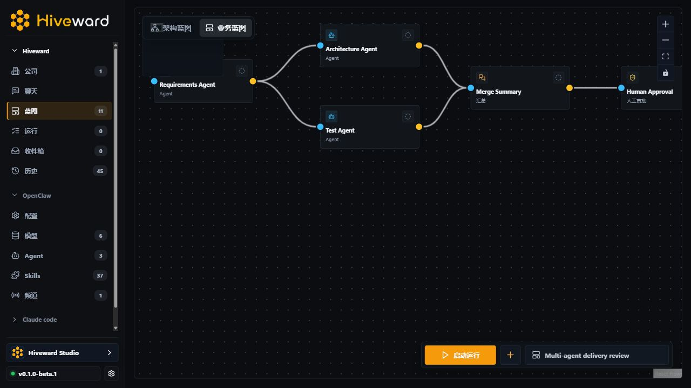
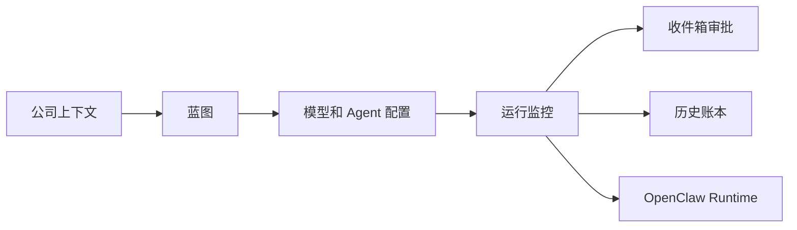
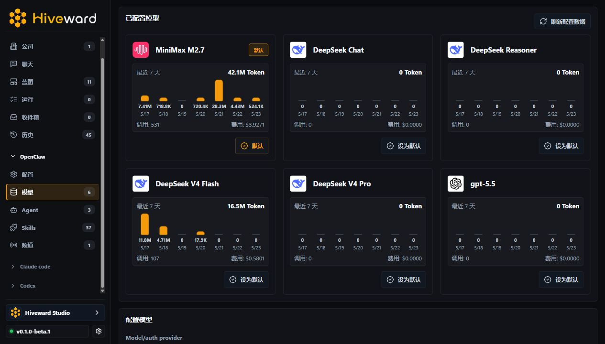
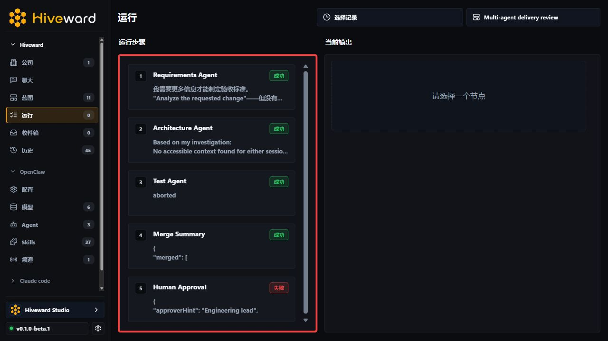
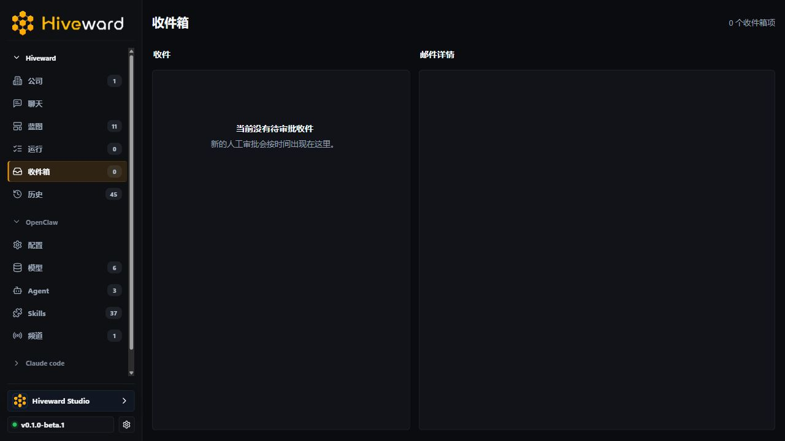
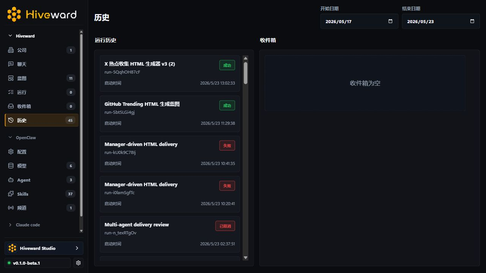

# Hiveward

<p align="center">
  <picture>
    <source media="(prefers-color-scheme: dark)" srcset="apps/web/public/brand/hiveward-wordmark-on-dark.png">
    
  </picture>
</p>

<p align="center">
  <strong>不是另一个聊天窗口，而是管理 Agent 团队的公司级指挥台。</strong>
</p>

<p align="center">
  开源的 Agent Company 工作台。把模型、Agent、蓝图、审批、运行和历史组织成一个可管理的数字公司。
</p>

<p align="center">
  
  
  
</p>

<p align="center">
  <a href="#hiveward-是什么">Hiveward 是什么</a> ·
  <a href="#为什么需要-hiveward">为什么需要</a> ·
  <a href="#它如何工作">它如何工作</a> ·
  <a href="#产品界面">产品界面</a> ·
  <a href="#快速开始">快速开始</a>
</p>

<p align="center">
  <a href="README.en.md">English</a> | <strong>简体中文</strong>
</p>

## Hiveward 是什么？

Hiveward 是一个面向 Agent Company 的开源工作台。它不试图再造一个模型，也不把所有东西塞进一个聊天框，而是给 Agent 团队一个可视化、可审批、可复盘的组织结构。

你可以把它理解成新一代 AI 组织的操作台：公司是边界，蓝图是组织结构，模型是资源池，收件箱是治理层，历史是执行账本。

Hiveward 负责管理和展示：公司目标、蓝图结构、节点配置、模型选择、运行状态、人工审批和历史记录。底层真实执行交给 OpenClaw 等 agent runtime，确保 Hiveward 是清晰的产品层，而不是把运行时细节藏进 UI。



## 为什么需要 Hiveward？

现在的 Agent 工具已经能写代码、查资料、跑任务，但大多数体验仍停留在“打开一个对话框，然后反复复制 prompt”。当任务变复杂，问题会很快出现：

- 任务没有组织结构，谁先做、谁复核、谁交付很难看清。
- 运行过程被藏在对话里，失败原因和中间产物难以追踪。
- 模型和 Agent 身份混在一起，很难知道真实执行者是谁。
- 需要人工决策时，没有稳定的审批入口。
- 做过的工作无法沉淀成可复用的团队能力。

Hiveward 的核心判断是：Agent 不应该只是“更聪明的聊天对象”，它应该变成可以被组织、管理和复盘的工作单位。

## 它如何工作？

1. 选择公司：每家公司拥有自己的目标、蓝图、运行记录和审批上下文。
2. 设计蓝图：把 Agent、Manager、并行分工、汇总、审批和交付节点放到同一张画布上。
3. 配置模型：从 OpenClaw 目录中查看模型、默认模型、Agent 身份和能力信息。
4. 启动运行：Hiveward 调度蓝图节点，展示每一步状态、输出和运行证据。
5. 审批与复盘：需要人类判断的节点进入收件箱，完成后的运行进入历史账本。



## 产品界面

### 蓝图指挥台

用画布表达 Agent 团队的协作结构。需求、架构、测试、汇总和人工审批可以同时出现在一个可运行的组织图里。


### 模型配置

查看可用模型、默认模型、模型用量和 OpenClaw 目录中的能力信息。模型不再只是隐藏在配置文件里的字符串，而是可被管理的团队资源。



### 运行监控

每次蓝图运行都有节点级状态、输出预览、失败状态和运行证据。你可以像看项目进度一样看 Agent 团队工作。



### 收件箱

当流程需要人类判断时，审批节点会进入收件箱。Hiveward 不追求盲目全自动，而是让自动化和治理可以共存。



### 历史

运行记录会沉淀成历史账本。成功、失败、输出摘要和运行时间都可以回看，方便复盘和迭代。



## 核心能力

- 公司级上下文：以公司为边界组织目标、蓝图、运行和审批。
- 蓝图编排：用可视化节点表达 Agent 团队的任务结构。
- Agent 团队管理：区分 Hiveward 展示身份和 OpenClaw 真实执行身份。
- 模型资源池：集中查看模型、默认模型、用量和 provider 状态。
- 人工治理：通过收件箱处理需要判断的审批节点。
- 运行账本：把每一次执行沉淀为可复盘的历史记录。
- Runtime 边界：Hiveward 负责产品层，OpenClaw 负责真实执行层。

## 当前状态

当前版本是第一个 beta：`v0.1.0-beta.1`。项目大约完成正式版目标的 80%，核心产品面已经可用于本地演示和早期体验，API 与交互细节仍可能继续调整。

## 快速开始

```bash
npm install
npm run dev
```

- Web 与 API：`http://localhost:5173`
- 健康检查：`http://localhost:5173/healthz`

默认 `OPENCLAW_ADAPTER=auto`。当本机能解析 OpenClaw Gateway 配置时，Hiveward 会连接真实 OpenClaw；否则会使用 mock 模式，方便本地演示和 UI 开发。

## 开发与仓库卫生

```bash
npm run check
npm test
npm run build
```

提交前请阅读 [CONTRIBUTING.md](CONTRIBUTING.md)，不要把密钥、本地运行数据、构建产物、内部工作记录或个人配置推到公开仓库。
