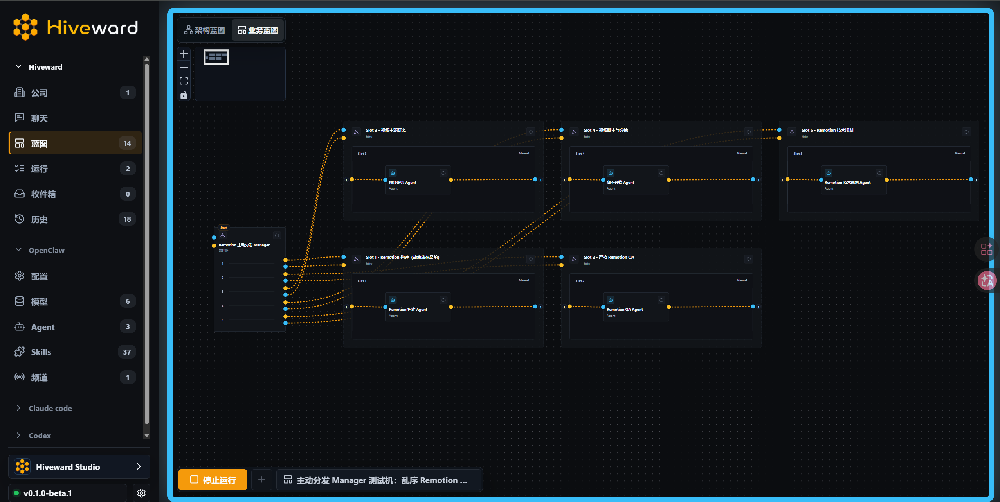
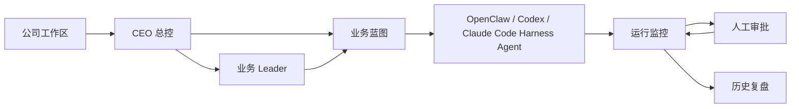

# HiveWard

<p align="center">
  <picture>
    <source media="(prefers-color-scheme: dark)" srcset="apps/web/public/brand/hiveward-wordmark-on-dark.png">
    
  </picture>
</p>

<h2 align="center">让101个Agent合作为你打工</h2>

<p align="center">
  把 Claude Code、Codex、OpenClaw 组织成一家可调度、可审批、可复盘的 Agent Company。
</p>

<p align="center">
  
  <a href="https://www.npmjs.com/package/@hiveward/cli"></a>
  
  
  
</p>

<p align="center">
  <a href="#hiveward-是什么">HiveWard 是什么？</a> ·
  <a href="#为什么选择-hiveward">为什么选择 HiveWard？</a> ·
  <a href="#它如何工作">它如何工作？</a> ·
  <a href="#快速开始">快速开始</a> ·
  <a href="#截图跳转链接">截图跳转链接</a> ·
  <a href="#微信群交流群">微信群交流群</a> ·
  <a href="#开源协议">开源协议</a>
</p>

<p align="center">
  <a href="README.en.md">English</a> | <strong>简体中文</strong>
</p>

<p align="center">
  <a href="docs/screenshots.md">
    
  </a>
</p>

## HiveWard 是什么？

HiveWard 的 slogan 是：让101个Agent合作为你打工。

它不是一个新的聊天框，而是一人公司的 Agent Company 工作台：把 Claude Code、Codex、OpenClaw 这样的 harness 当成可组织的员工，让它们在公司、CEO、Leader、蓝图、审批和历史记录里协同起来。

## 为什么选择 HiveWard？

HiveWard 的定位绝不是对抗 OpenClaw、Claude Code 或 Codex，也不是代替 Skill 或 n8n。而是站在它们之上一层：把单打独斗的强力 harness 打造成可调度、可组织、可审批、可复用、可审计的业务蓝图节点。

| 维度 | HiveWard | Multica | Paperclip | OpenClaw | Claude Code + Skill | n8n |
| --- | ---: | ---: | ---: | ---: | ---: | ---: |
| 自由构建多 Agent 组织架构 | ⭐⭐⭐ | ⭐ | ⭐ | ⭐ | ⭐ | ⭐⭐⭐ |
| 跨 Claude / Codex / OpenClaw 调度 | ⭐⭐⭐ | ⭐⭐⭐ | ⭐⭐ | ⭐ | ⭐ | ⭐ |
| 保留原生 harness 能力 | ⭐⭐⭐ | ⭐⭐⭐ | ⭐⭐ | ⭐⭐⭐ | ⭐⭐⭐ | ⭐ |
| 工作流中人工审批/治理/微调 | ⭐⭐⭐ | ⭐⭐ | ⭐ | ⭐⭐⭐ | ⭐ | ⭐ |
| Agent 自主判断与循环 | ⭐⭐⭐ | ⭐⭐⭐ | ⭐⭐⭐ | ⭐ | ⭐⭐ | ⭐ |
| 上下文压力控制 | ⭐⭐⭐ | ⭐⭐ | ⭐⭐ | ⭐ | ⭐ | ⭐ |
| 流程复用与经验沉淀 | ⭐⭐⭐ | ⭐⭐ | ⭐ | ⭐⭐ | ⭐⭐ | ⭐⭐ |
| 最适合的定位 | HiveWard：Agent Company 业务蓝图调度层 | Multica：Agent 团队任务板 | Paperclip：AI 公司控制平面 | OpenClaw：本地 AI 执行员工 | Claude Code + Skill：代码执行器与技能系统 | n8n：通用自动化工作流 |

## 它如何工作？

HiveWard 的使用入口不是“新建一次聊天”，而是先建立一家公司。一个公司就是一个独立工作区：它有自己的目标、蓝图、运行记录、审批队列、聊天上下文和历史视图。切换公司时，看到的是另一套业务现场。

进入公司后，最上层是 CEO。CEO 是这家公司的总控席位，可以看到所有 Leader、所有业务蓝图、所有运行状态和所有待审批事项。你可以从 CEO 视角创建或导入蓝图，也可以把一个方向交给对应 Leader 去推进。

每个 Leader 绑定一张业务蓝图。蓝图越多，公司下面的 Leader 就越多；每个 Leader 只负责自己的业务线，能围绕这张蓝图沟通、改方案、提交蓝图提案，并把需要你拍板的地方送进审批入口。CEO 管 Leader，Leader 管自己负责的蓝图，这就是 HiveWard 的组织层。

蓝图是实际干活的调度图。你在画布上安排 Agent、Manager、Slot、汇总、条件和审批节点。真正承接工作的节点都是 Harness Agent：可以选择 OpenClaw、Codex 或 Claude Code 作为运行来源，继续使用它们原生的模型、工具、技能、会话、权限和工作目录能力。HiveWard 不把这些员工削成简化版聊天框，它做的是总控和编排。

运行时，HiveWard 会按蓝图的连线和节点状态推进任务：上游节点完成后，下游节点拿到输入；Manager 节点可以读取前面的结果，再决定把任务交给哪个 Slot；Slot 可以承载多条并行执行线；需要人判断的 Agent 输出会暂停在审批状态，等你批准、拒绝或回复后再继续。

所以实际流程是：先建公司，再让 CEO 组织 Leader；再为每条业务线创建蓝图；再把每个蓝图节点绑定到合适的 Harness Agent；最后由 HiveWard 负责调度、监控、审批和沉淀历史。Claude Code、Codex、OpenClaw 负责把事情真正做完，HiveWard 负责让它们像一个团队一样被组织起来。



## 快速开始

如果你只想把 HiveWard 跑起来，可以使用 npm CLI：

```bash
npm install -g @hiveward/cli
hiveward setup
hiveward start
```

也可以不全局安装，直接通过 npx 启动：

```bash
npx @hiveward/cli@beta setup
npx @hiveward/cli@beta start
```

启动后访问：

- 总控台：`http://localhost:10101`
- 健康检查：`http://localhost:10101/healthz`

从源码运行：

```bash
npm install
npm run check:env
npm run dev
```

默认情况下，HiveWard 会优先连接本机可用的 OpenClaw Gateway；如果没有检测到真实配置，会进入 mock 模式，方便先体验界面和蓝图流转。

### 权限提示

当前 beta 版本的 Codex 和 Claude Code 聊天 Harness 默认使用安全模式，不会自动授予完整的文件读写、命令执行、联网和实时网页搜索权限。

如果你希望更接近原生 CLI 的高效率体验，可以在对应的 Harness 配置页手动开启全权限模式。请只在你信任的本地仓库和运行环境中开启；不要在包含敏感凭据、生产密钥或不可恢复文件的目录中直接运行。

## 截图跳转链接

点击首屏截图，或进入 [HiveWard 产品截图](docs/screenshots.md) 查看更多界面：

- 蓝图指挥台
- 模型与员工配置
- 运行监控
- 审批入口
- 历史复盘

## 微信群交流群

<p align="center">
  
</p>

## 开源协议

本项目采用 Apache License 2.0 协议开源。完整协议见 [LICENSE](LICENSE)。
