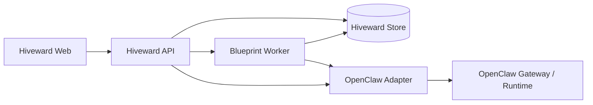

# Hiveward

<p align="center">
  <picture>
    <source media="(prefers-color-scheme: dark)" srcset="apps/web/public/brand/hiveward-wordmark-on-dark.png">
    
  </picture>
</p>

<p align="center">
  <strong>Blueprint command layer for agent companies.</strong><br>
  First beta: <code>v0.1.0-beta.1</code>
</p>

<p align="center">
  <a href="#中文">中文</a> | <a href="#english">English</a> | <a href="#screenshots--产品截图">Screenshots</a>
</p>

## 中文

Hiveward 是一个面向 Agent Company 的指挥层。它把零散的模型、Agent、工具、审批和运行记录，组织成可被管理的公司级工作系统：一家公司可以有自己的蓝图、角色、模型配置、运行视图、收件箱和历史账本。

我们相信，多 Agent 产品的下一步不是再打开一个聊天窗口，而是把 Agent 当作一个可编排、可审计、可交接的组织。Hiveward 的目标是让操作者像管理一个新型数字公司一样管理 Agent 团队：把任务拆进蓝图，把模型和执行身份绑定到节点，把产出推进到收件箱，把每一次运行沉淀成可复盘的历史。

当前版本是第一个 beta 版本，约完成正式版目标的 80%。核心产品面已经可用，API 和交互仍可能继续调整。

### 核心叙事

传统自动化把流程写死，传统聊天把上下文藏在对话里。Hiveward 选择第三条路：让 Agent 以公司、团队、蓝图和运行账本的方式存在。

- 公司是边界：不同公司拥有不同目标、蓝图和运行上下文。
- 蓝图是组织结构：Agent、Manager、并行分工、审批、汇总和交付节点被放在同一张可视化画布上。
- 模型是资源池：OpenClaw 提供真实运行时和模型目录，Hiveward 管理模型选择、默认模型、Agent 身份和配置状态。
- 收件箱是治理层：关键节点可以暂停，等待人工审批后继续交付。
- 历史是账本：运行结果、失败状态、输出摘要和 OpenClaw 引用都可以回看。

### 功能

- 蓝图画布：设计多 Agent 流程、分支、汇总、审批和发送节点。
- Agent 团队管理：在 Hiveward 中维护可解释的显示身份，在 OpenClaw 中保留真实运行身份。
- 模型配置：查看可用模型、默认模型、模型用量和 Provider 状态。
- 运行监控：查看每个节点的状态、输出、失败原因和结构化运行证据。
- 收件箱审批：把需要人工决策的流程节点集中到收件箱处理。
- 历史回放：按时间范围查看运行记录和审批记录。
- OpenClaw 边界：Hiveward 负责产品层和状态层，OpenClaw 负责真实 Agent 执行、模型、工具和运行时事实。

### 本地运行

```bash
npm install
npm run dev
```

- Web 与 API：`http://localhost:5173`
- API 健康检查：`http://localhost:5173/healthz`

默认 `OPENCLAW_ADAPTER=auto`。当本机能解析 OpenClaw Gateway 配置时，Hiveward 会连接真实 OpenClaw；否则会使用 mock 路径，方便本地演示和 UI 开发。

### 验证

```bash
npm run check
npm test
```

边界检查：

```bash
npm run check:boundaries
```

## English

Hiveward is a command layer for agent companies. It turns scattered models, agents, tools, approvals, and run records into a managed operating surface: each company gets its own blueprints, roles, model configuration, run monitor, inbox, and execution history.

The next step for multi-agent software is not another chat tab. It is an organization model. Hiveward treats agents as teams with roles, handoffs, ledgers, and review gates. Operators can design the blueprint, bind runtime identity, inspect outputs, approve pauses, and review the history of what happened.

This is the first beta release, `v0.1.0-beta.1`. The project is roughly 80% of the way to the intended formal release. The core surfaces are usable, while APIs and interaction details may still evolve.

### Product Narrative

Automation scripts freeze the process. Chat logs hide the process. Hiveward makes the process visible.

- Company as scope: every company carries its own business goal, blueprints, and run context.
- Blueprint as organization chart: agents, managers, parallel lanes, approvals, summaries, and delivery nodes live on one canvas.
- Models as resource pool: OpenClaw provides the runtime catalog; Hiveward presents model selection, defaults, agent identity, and configuration state.
- Inbox as governance: critical workflow steps can pause for human review.
- History as ledger: runs, statuses, output summaries, and OpenClaw references remain inspectable.

### Features

- Blueprint studio for multi-agent workflows, handoffs, branches, summaries, approvals, and send nodes.
- Agent team management with clear Hiveward display labels and explicit OpenClaw runtime identity.
- Model configuration for available models, default model, provider state, and recent usage.
- Run monitor for node status, outputs, failure states, and structured execution evidence.
- Inbox approvals for human-in-the-loop gates.
- History view for previous runs and inbox activity.
- OpenClaw boundary discipline: Hiveward owns product state and command surfaces; OpenClaw owns execution, models, tools, sessions, transcripts, and runtime facts.

### Run Locally

```bash
npm install
npm run dev
```

- Web and API: `http://localhost:5173`
- API health check: `http://localhost:5173/healthz`

The default adapter mode is `OPENCLAW_ADAPTER=auto`. Hiveward connects to a real OpenClaw Gateway when local Gateway configuration is available, and falls back to mock mode otherwise.

### Verify

```bash
npm run check
npm test
```

Boundary guard:

```bash
npm run check:boundaries
```

## Screenshots / 产品截图

### Blueprint Studio / 蓝图指挥台

把 Agent 团队变成一张可运行的组织图：需求、架构、测试、汇总和审批都在同一个治理画布上。

Visualize an agent team as a working organization: requirements, architecture, tests, summary, and approval all live on one governed canvas.


### Model Configuration / 模型配置

查看已配置模型、默认模型、用量和 OpenClaw 目录中的模型能力。

Inspect configured models, defaults, usage, and model capability from the OpenClaw catalog.


### Run Monitor / 运行监控

跟踪节点级执行状态、输出预览、失败状态和运行时证据。

Track node-level execution, output previews, status, and runtime evidence.


### Inbox / 收件箱

需要人工决策的治理节点会集中进入收件箱。

Human review gates collect in one operational inbox.


### History / 历史

每次运行都会成为可复盘的执行账本。

Every run becomes part of an inspectable execution ledger.


## Architecture / 架构



Hiveward owns blueprint definitions, canvas state, node configuration, run views, approval state, company context, and local display state. OpenClaw owns agents, models, tools, channels, sessions, transcripts, runtime execution, usage facts, and delivery integrations.

## Release Channel / 发布通道

Current beta: `v0.1.0-beta.1`

This beta is intended for early repository presentation, local demos, and continued product hardening before a formal stable release.
