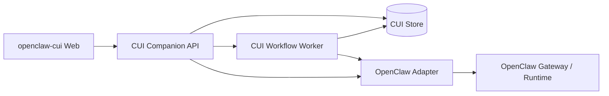

# Architecture

`openclaw-cui` is a product and orchestration layer, not a replacement runtime.

## Ownership

| Area | Owner |
| --- | --- |
| Workflow canvas, graph, layout, versions | CUI |
| Workflow runs, node runs, approval state | CUI |
| Dashboard widgets, saved views, tags, notes | CUI |
| Agents, tasks, tools, model fallback, channel SDKs | OpenClaw |
| Provider usage facts and execution transcripts | OpenClaw |

## Runtime Shape

## MVP Scope

- Web canvas for workflow editing and run observation.
- Companion API for CUI-owned state.
- In-process workflow worker for orchestration.
- Adapter interface with both mock and OpenClaw Gateway implementations.
- Boundary check script for CI.

## Gateway Adapter

The default adapter mode is `auto`. In `auto`, the API uses the real OpenClaw Gateway when it can resolve connection settings from environment variables or `~/.openclaw/openclaw.json`; otherwise it falls back to the mock adapter for local UI development.

`OPENCLAW_ADAPTER=real` or `OPENCLAW_ADAPTER=gateway` makes missing Gateway configuration a startup error. `OPENCLAW_ADAPTER=mock` forces the deterministic mock implementation.
