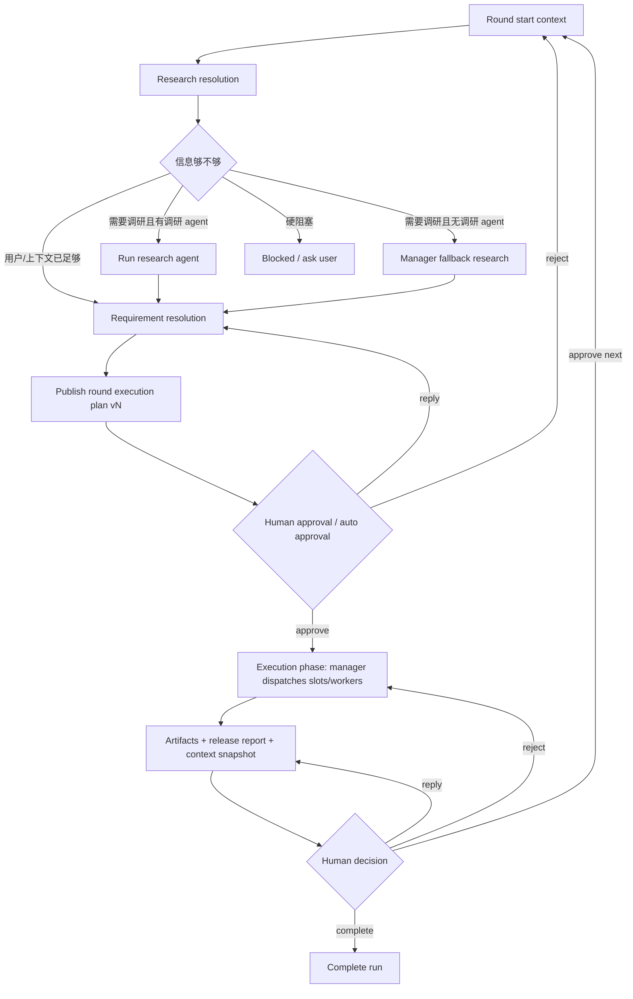

# Manager 自迭代最终需求文档

## 结论

Manager 自迭代里，“调研”和“提需”不是每轮都必须机械执行的两个节点，而是每轮开始必须解决的两个问题：

1. 信息够不够：是否需要调研。
2. 这一轮干什么：是否已经有清楚的本轮计划。

解决方式按优先级走：

```text
用户已经给了 -> 直接使用
用户没给，但配置了专门 agent -> 让专门 agent 做
没配置专门 agent -> manager 兜底
manager 也无法确定 -> 带假设推进并标风险，只有硬阻塞才停
```

所以，全自动模式不能因为没有调研 agent 或提需 agent 就跑不下去。专门 agent 是增强项，manager 是兜底项。

## 目标

实现一个真实多轮推进的 manager 自迭代链路：

- 每轮都能判断是否需要调研。
- 每轮进入实际执行前都有明确的本轮计划。
- 用户可以配置专门的调研 agent 和提需 agent。
- 没有配置专门 agent 时，manager 自动兜底。
- manager 通过平台注入的结构化上下文获得连续记忆。
- worker 子节点不做平台级跨轮上下文管理。
- 下一轮不是模板拼出来，而是基于上一轮报告、用户反馈、上下文快照重新判断。

## 非目标

- 不做 manager harness 层 memory。
- 不做 worker harness 层 memory。
- 不做向量召回、长期记忆、跨 run 记忆。
- 不把后续 leader 监控者摘要纳入本期。
- 不处理前端 big chunk 体积警告。

## 核心概念

### Round start context

每轮启动时的平台输入包。它来自：

- 初始目标。
- 固定约束。
- 用户最新反馈。
- 上一轮报告。
- 上一轮 manager context snapshot。
- 当前产物索引。
- 未解决问题。
- 已否决方案。
- 当前风险和假设。

### Research resolution

每轮开始时解决“信息够不够”的过程。

结果可以是：

- `user_provided`：用户已经给了足够信息。
- `context_sufficient`：上一轮报告和上下文已经足够。
- `agent_generated`：由配置的调研 agent 产出。
- `manager_fallback`：没有调研 agent，由 manager 兜底。
- `assumption_based`：信息仍不完美，但全自动模式下带假设继续。
- `blocked`：遇到权限、凭证、外部不可替代事实等硬阻塞。

### Requirement resolution

每轮开始时解决“这一轮干什么”的过程，也就是形成 round execution plan。

结果可以是：

- `user_provided`：用户已经明确给了本轮计划。
- `agent_generated`：由配置的提需 agent 产出。
- `manager_fallback`：没有提需 agent，由 manager 兜底。
- `revised_from_reply`：根据用户 reply 生成 vN 修订版。

### Round execution plan

本轮执行计划。它是审批对象，不只是“提需文本”。

必须包含：

- 本轮目标。
- 本轮范围。
- 不做什么。
- 输入依据。
- 调研状态：做了、跳过、兜底、还是带假设。
- 关键假设和风险。
- 验收标准。
- 预期产物。
- 计划版本号。

### Manager run-context injection

平台在每次调用 manager 时注入结构化上下文。它不是 harness memory，只是本次 prompt 输入。

manager 每轮至少看到：

- 固定底座：原始目标、硬约束、成功标准。
- 运行记忆：完成项、否决项、关键决策、有效事实、开放问题、风险。
- 上一轮热信息：报告、用户反馈、下一步建议。
- 本轮任务包：当前轮次、调研状态、计划状态、产物索引、决策合同。

### Manager context snapshot

每轮结束时沉淀的结构化摘要。它记录局势，不记录流水账。

多轮时不把历史全塞给 manager。第 5 轮看到的是：

```text
固定底座 + S4 manager context snapshot + 第4轮报告/用户反馈 + 第5轮任务包
```

## Manager 配置需求

Manager 配置区需要两个可选下拉：

1. 调研 agent。
2. 提需 agent。

这两个都不是必填，但必须有明确提醒：

> 建议选择专门的调研 / 提需 agent。未选择时由 Manager 兜底完成，全自动运行仍会继续，但质量取决于 Manager 能力和上下文完整度。

如果用户没有配置：

- 没有调研 agent：manager 判断和兜底调研。
- 没有提需 agent：manager 生成 round execution plan。
- 两个都没有：manager 负责完整 preflight。

## 每轮标准链路



## 跳过规则

调研可以跳过，但必须说明原因。

合理原因：

- 用户已经给了足够事实。
- 上一轮报告已经覆盖本轮所需事实。
- 本轮只是修订已有产物。
- manager 判断新增调研没有必要。

提需 agent 也可以跳过，但 round execution plan 不能缺失。

plan 可以来自：

- 用户直接输入。
- 提需 agent。
- manager 兜底。
- 用户 reply 后的修订版。

## 全自动模式规则

全自动模式下，系统默认不断路：

```text
缺调研 agent -> manager 兜底
缺提需 agent -> manager 兜底
信息不完整 -> manager 带假设推进，并在 plan/report 中标风险
```

只有这些情况可以停：

- 需要用户账号、密钥、权限。
- 需要生产环境破坏性操作。
- 需要不可编造的外部事实，且当前 runtime 无法获取。
- 用户明确要求必须等待确认。

## 审批语义

### Round execution plan 审批

用户审批的是“这一轮实际怎么干”。

- `approve`：进入实际执行。
- `reply`：根据反馈生成计划 vN。
- `reject`：退回 round start context，重新判断调研和计划。

### Release report 审批

用户审批的是“这一轮结果是否接受，以及是否继续”。

- `approve next`：接受本轮，进入下一轮 round start context。
- `complete`：结束 run。
- `reply`：生成报告 vN。
- `reject`：不接受结果，重跑当前轮执行阶段。

旧审批和旧邮件必须能打开查看，但不能继续操作。

## 当前必须修复的断点

### 1. 下一轮不能模板生成

approve next 后不能直接把上一轮报告拼成下一轮需求。

必须改成：

```text
release report + human decision + context snapshot
-> round start context
-> research resolution
-> requirement resolution
-> round execution plan approval
```

### 2. 调研 agent 缺失不能阻塞

没有调研 agent 时，manager 兜底；不能要求用户必须接调研节点。

### 3. 提需 agent 缺失不能阻塞

没有提需 agent 时，manager 兜底；但 plan 必须存在。

### 4. Manager 必须注入连续上下文

不能依赖 runtime 自己记得上一轮。每次 manager preflight 和 dispatch 都要注入 run-context。

### 5. Worker 子节点不做跨轮上下文管理

worker 只接收 manager 本次分发给它的局部任务上下文。

### 6. 产物必须可追踪

HTML、markdown、json、file、link 都应该成为 artifact，有标题、类型、版本、来源 round/node、下载或预览入口。

### 7. 工程拆分必须围绕链路修

不是为了好看大拆，而是必须把 round preflight、context injection、next round orchestration 从 `BlueprintWorker` 里抽出来，避免核心链路继续堆在一个文件里。

## 最终验收标准

- Manager 配置区有调研 agent 和提需 agent 两个可选下拉。
- 两个下拉都为空时，全自动 run 仍能继续，由 manager 兜底。
- 每轮开始都会形成 research resolution 结果。
- 每轮执行前都有 round execution plan。
- plan 清楚标注调研来源、计划来源、假设、风险、版本号。
- approve next 不再模板生成下一轮计划。
- 下一轮一定从 round start context 开始。
- manager 每次 preflight/dispatch 都收到 run-context injection。
- worker 子节点不被平台塞跨轮完整上下文。
- report approve next、complete、reply、reject 都能跑通。
- 旧审批可查看不可操作。
- HTML/markdown/json 产物都能落盘、预览或下载。
- 测试覆盖至少三轮自迭代，以及“无调研 agent / 无提需 agent manager 兜底”。

